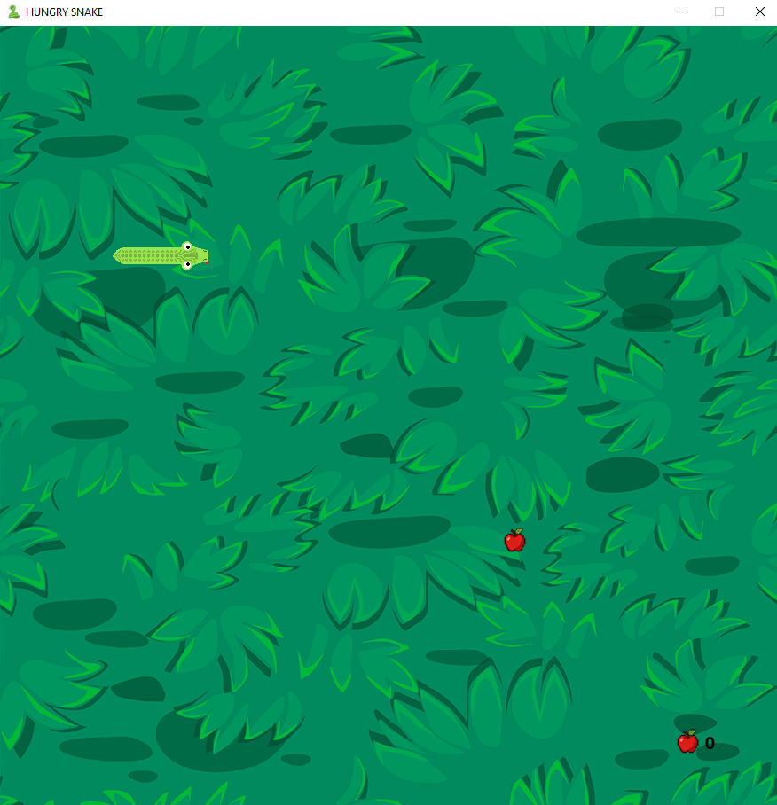

# 🐍 Hungry Snake  
---

## Description  
**Hungry Snake** is a modern take on the classic Snake Game built with **Pygame**.  
The objective is simple: control the snake, eat apples, grow longer, and survive as long as possible without colliding with yourself or the walls.  

### Features 
- Smooth graphics with a custom background and snake sprites  
- Sound effects for apple bites 🎵  
- Score tracking system  
- Game over + restart support

### Controls  
- ⬆️ **Up Arrow** → Move Up  
- ⬇️ **Down Arrow** → Move Down  
- ⬅️ **Left Arrow** → Move Left  
- ➡️ **Right Arrow** → Move Right 

---
## Screenshot  



---

## Configuration  
- **Assets:** Store visuals in `Visuals/` and sounds in `Sounds/`.  
- **Settings:** Modify `block_size`, `block_number`, or `SCREEN_UPDATE` delay in `main.py` for custom grid sizes or game speed.  

---

## Technologies Used  
- [Python 3](https://www.python.org/)   
- [Pygame](https://www.pygame.org/news)  

---

## Project Structure

```
├── main.py          # Main game file
├── Visuals/         # Directory containing game graphics
│   ├── Icon.png
│   ├── Grass_background.png
│   ├── Apple.png
│   ├── head_up.png, head_down.png, head_left.png, head_right.png
│   ├── tail_up.png, tail_down.png, tail_left.png, tail_right.png
│   ├── curve_top_left.png, curve_top_right.png
│   ├── curve_bottom_left.png, curve_bottom_right.png
│   ├── body_horizontal.png, body_vertical.png
└── Sounds/          # Directory containing game sounds
    └── Bite.mp3
```

---

## License

This project is not for commercial use.

---

## 👤 Contact  
- **Author:** Abdul-Rehamn  
- **GitHub:** [C0ding-Craze](https://github.com/C0ding-Craze)  
